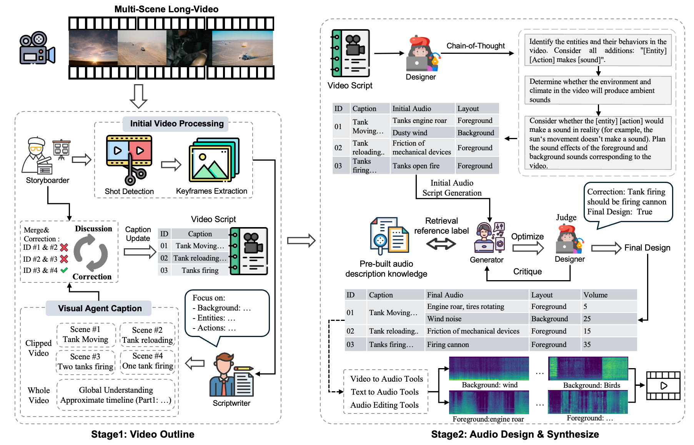

# 🎬 LVAS-Agent  

[](https://opensource.org/licenses/MIT)  
[]((https://lvas-agent.github.io/)
[](https://arxiv.org/abs/2503.10719)

---

## 🏗️ LVAS-Agent Framework
  

---

## 🚀 Features  
- [] Release online gradio demo.
- [] Release local gradio demo.
- [] Release benchmark data.   

---

## 🔧 Installation & Usage  
Comming soon ...

---

## 📄 Citation  
```bibtex
@misc{zhang2025longvideoaudiosynthesismultiagent,
      title={Long-Video Audio Synthesis with Multi-Agent Collaboration}, 
      author={Yehang Zhang and Xinli Xu and Xiaojie Xu and Li Liu and Yingcong Chen},
      year={2025},
      eprint={2503.10719},
      archivePrefix={arXiv},
      primaryClass={cs.CV},
      url={https://arxiv.org/abs/2503.10719}, 
}
